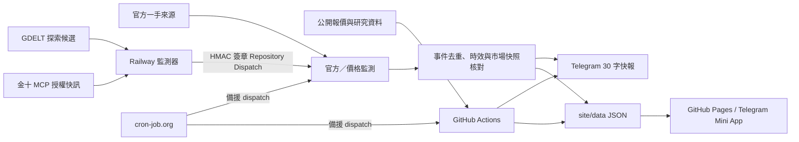

# PRStK Investment System

PRStK 是部署於 GitHub 的公開市場資訊整理、風險監測與量化研究系統。它以繁體中文產生 Apple Watch 友善的 Telegram 快報，並以 GitHub Pages 提供 Telegram Mini App 儀表板。

> 僅整理公開或已授權資料、模型研究及教育性風險觀察，不構成投資建議。本系統不讀取券商、銀行、錢包或其他私人帳戶，不要求密碼、OTP 或憑證，亦不會自動交易。

## 服務範圍

- **Telegram 快報**：固定報告與符合門檻的速報；本文限制 30 字內，按鈕為「📡 開啟稜量速報系統」。
- **Telegram Mini App**：GitHub Pages 儀表板顯示完整市場卡、風控、研究清單、已核對事件與資料時間。
- **公開市場快照**：台股、日股、韓股、美股、半導體、能源、黃金與加密資產的公開報價、交易日與資料新鮮度。
- **重大事件流程**：官方一手來源、金十 MCP 授權快訊，及「多來源交叉核對」的探索訊號，皆經去重與市場資料核對才可能推播。
- **研究選股**：台美股的動能狙擊、三維共振、裸 K 結構與獨立璞玉價值池；結果僅是可重現的研究排序。
- **台股 Macro FGI**：以公開日資料計算台股市場情緒的五因子百分位模型。
- **可靠性機制**：GitHub Actions 主排程、cron-job.org Repository Dispatch 備援、推播去重、來源失敗隔離、Telegram 逐一送達重試。

## 系統架構



## 資料更新、掃描與推播時間

所有時間均為台灣時間（UTC+8）。GitHub Actions 與 cron-job.org 都可能延後執行，因此「時間」是目標排程，不是交易所逐筆行情承諾。每個定時快報會先刷新公開市場資料、再寫入 `site/data/market.json`、發 Telegram、部署 Mini App。

| 類別 | 目標時間／頻率 | 工作內容 |
|---|---|---|
| 晨報 | 工作日 06:00 | 隔夜市場、總經／風險脈絡與代表標的公開快照 |
| 台股時段快報 | 工作日 08:45、10:00、11:45、13:15 | 優先檢視台指／台股盤勢與其連動市場 |
| 全市場量化研究 | 工作日 13:30 | 掃描台美研究母體；工作流程最長容許 55 分鐘 |
| 盤後速報 | 工作日 14:45 | 刷新研究結果後的台股盤後摘要與 Mini App |
| 美股盤前 | 工作日 21:00，全年固定 | 台股回顧、美股盤前與國際風險快照 |
| 官方／價格訊號 | 工作日每 5 分鐘 | 官方事件候選與固定價格門檻；只有符合規則才推播 |
| 金十 MCP | Railway 預設每 120 秒 | 已授權 `list_flash` 快訊去重與簽章觸發 |
| GDELT 交叉核對 | Railway 預設每 15 分鐘 | 只作候選線索；需兩個可信媒體網域與同一事件錨點才可觸發 |

市場休市或公開來源未提供新盤中列時，系統保留最近可核對收盤並標示資料日期／狀態；延遲報價不應觸發價格速報。Mini App 是靜態 Pages：它在「資料刷新或事件推播成功後」更新，不會因使用者單純開啟頁面而自行向交易所重新取價。

## 重大事件與快訊規則

### 來源層級

| 層級 | 來源 | 用法 |
|---|---|---|
| 一手官方 | Fed、BLS、BEA、EIA、SEC EDGAR、TWSE、MOPS、TAIFEX、中央銀行、金管會、主計總處、經濟部、USGS、GDACS、CISA、WHO 等 | 直接進入候選事件流程；只有新鮮且重大者才送出 |
| 已授權快訊 | 金十 MCP | Railway 僅讀取授權 `list_flash`；事件 ID 去重後以 HMAC 簽章送入 GitHub |
| 探索／交叉核對 | GDELT 聚合的 Reuters、AP、Bloomberg、FT、WSJ、NYT、BBC、CNBC、Nikkei 等可信網域 | 不是直接新聞爬蟲或單一來源觸發器；同類事件必須至少兩個不同可信網域、同一具體錨點才可能送入 GitHub |

GDELT 首次成功讀取只建立基線，不補發舊聞；成功快取 15 分鐘，暫時失敗或限流時最多使用 120 分鐘內的最近成功快取並標示時間，不採繞過限流。探索候選必須由至少兩個可信網域共享同一人物／地點／動作交集；黑天鵝仍須一手官方來源確認。官方來源或探索來源失敗不會使其他來源改用舊資料推播。

### 重大性與價格門檻

| 類別 | 事件或變動門檻 | Mini App 核對重點 |
|---|---|---|
| 官方總經／政策 | FOMC、CPI、PCE、非農、GDP、重大關稅／出口管制／制裁等新鮮且方向性公告 | 美債、美元、Nasdaq、費半、台股科技 |
| 地緣／能源／黑天鵝 | 戰爭、停火、重大供應中斷、USGS／GDACS 等級事件；能源需有供給或地緣脈絡 | WTI／Brent、黃金、美元與主要股市 |
| 半導體／權值 | 台積電、NVIDIA、ASML 等的方向性財報、展望、資本支出或出口管制 | 費半、Nasdaq、台股電子權值 |
| 重要正向事件 | 可核對的停火、和平、關稅豁免、降息等具廣泛影響事件 | 相關股市、利率、商品與風險偏好 |
| 日內價格 | 台指日變動 1.5%、費半 3%、Nasdaq 2%、WTI／Brent 5%；15 分鐘變動台指／費半／Nasdaq 1%、油價 2% | 該標的與至少兩個相關市場的可核對報價 |

工作日 08:45–13:30 的價格速報優先台指／台股盤勢。單一商品或加密資產的日內變動通常只更新 Mini App；只有已核對的重大政策、總經、戰爭或重要公司事件才會取代台股優先訊號進入短訊息。

同一事件以事件 ID 去重；同類消息預設 30 分鐘冷卻。台指高風險／高波動狀態最多每 60 分鐘補送一次，且必須有新鮮報價、風險階段跨越或明顯反轉。所有詳細內容採「已知事實／可能影響／後續觀察」結構，明示教育性用途，沒有買賣、目標價、進出場或部位指令。

## 量化研究策略

所有策略皆以已完成的公開日 K／公開財務資料輸出；不同策略的分數**不可互相比較**，也不代表報酬機率或保證。

### 1. 動能狙擊（Kinetic Sniper）

這是右側、順勢的價格與波動相對排名。先以「收盤價不低於 5 日均線」作為硬性防守濾網，再於可投資流動性的母體內計算百分位加權分數，取前 5 名。

| 特徵 | 權重 | 研究含義 |
|---|---:|---|
| 20 日年化歷史波動率 | 29.08% | 價格活性與波動擴張 |
| 布林通道寬度 | 19.33% | 收斂後擴張的價格環境 |
| 相對 60 日均線乖離 | 10.39% | 中期趨勢位置 |
| 5／60 日均線發散 | 7.67% | 短中期趨勢強度 |
| 相對 20 日均線乖離 | 7.26% | 月線位置 |
| 相對布林上軌 | 5.09% | 強勢區間位置 |
| 10 日 ROC | 4.25% | 近兩週絕對動能 |

另標示 VCP 收斂突破（近 5 日振幅相對前期收斂、突破 20 日高點、量能至少為 20 日均量 1.2 倍）、量能放大與 3／5／20 日新高。台股動能研究另設每日成交額至少 **3,000 萬元**的流動性門檻；美股研究以公開大型股母體與最低成交額過濾。此處是研究排序，不是進場訊號。

### 2. 三維共振（3D Resonance）

這是左側、以公開日線尋找「恐慌／中性區的聰明錢痕跡」的研究模型。個股 FGI 必須小於 56，再依下列四項條件篩選：四項全符合優先；當日無四項時，才顯示符合三項的備選，最多 5 名。

| 優先順序 | Smart Money 條件 | 公開日線定義 | 權重 |
|---:|---|---|---:|
| 1 | 爆量吸收／長下影 | 成交量 ≥ 20 日均量 1.2 倍，或下影線 > 實體 1.5 倍 | 35 |
| 2 | 跌破前低後收回 | Low < 前一日 Low 且 Close > 前一日 Low | 30 |
| 3 | 相對大盤 Alpha > 0 | 當日個股報酬大於對應大盤 | 20 |
| 4 | 波動率擴張 | True Range > 14 日 ATR × 1.1 | 15 |

個股 FGI 的研究組成為價格位置（Bias／RSI）20%、波動與布林位置 20%、五日資金流代理 35%、量能／周轉代理 25%。畫面會顯示實際符合的橘色條件，避免將未符合條件包裝為訊號。

### 3. 裸 K 結構（Price Action）

裸 K 只在回檔結構邊緣研究，不追逐剛突破的噴發 K：當日收盤必須低於前 5 日高點，且下影線大於 ATR 的 10%。歷史轉折點採至少 5 根後續已完成 K 線確認，避免將尚未定型的當日高低點當成結構。

| 型態 | 公開量化條件 | 結構相符度基礎分 |
|---|---|---:|
| 撐壓互換回踩 | 已帶量突破前高後，回踩前高附近且收盤守住前高實體上緣 | 70 |
| 雙底右腳確認／區間邊界 | 兩個已確認低點差距不超過 2%，當日回踩並守住邊界 | 70 |
| 假跌破收復（Spring） | 盤中低於已確認支撐低點，收盤收回支撐之上 | 85 |
| 嚴格訂單塊回踩 | 爆量黑 K（≥20 日均量 1.5 倍）後接強勢陽線，且首次回踩區間守住並有下影線 | 80 |

多型態同時成立，每多一項加 5 分，最多加 15 分；排序先看結構相符度，再看成交額。ATR 與結構邊界僅保留於獨立研究／回測，不會在 Mini App 變成交易指令。

### 4. 璞玉價值（獨立公開基本面池）

價值研究不從其他三種技術策略回頭挑股。台股母體為 **0050 + 0051** 的最新公開 PCF／持股表，美股母體為 **Vanguard VOO** 官方持股表。

| 市場 | 基本面來源 | 覆核條件 |
|---|---|---|
| 台股 | TWSE OpenAPI 最新財報／本益比，加上 MOPS 歷史 EPS 與股利公告 | 六項條件中至少 5 項且資料完整才列正式候選；ROE、淨利、本益比僅作補充評分，不是硬性門檻 |
| 美股 | SEC EDGAR CompanyFacts 與 VOO 官方持股表 | 最近可得年度淨利至少 5 億美元、ROE、現金股利／配息與本益比等公開欄位 |

璞玉價值採六項條件：最近三年 EPS 每年為正、最近四季 EPS 每季為正，以及近三個月平均成交金額、平均成交股數、自由流通週轉率、三個月漲幅均不在市場前 10%。正式候選需完整資料且至少 5/6（最多 5 檔）；觀察名單需完整資料且為 3/6 或 4/6（最多 5 檔）。ROE、淨利、本益比只作補充評分；MOPS 歷史資料建檔未完成前不列入任何候選。

### 台股 Macro FGI

TAIEX Macro FGI 是台股市場風險偏好的公開日資料模型，不是個股買賣評分。資料使用 `^TWII`、`^TWOII` 與 `TWD=X` 的兩年日資料，並在每項的最近 120 個交易日歷史中計算百分位。

| 因子 | 權重 | 高分含義 |
|---|---:|---|
| 加權指數相對 125 日均線乖離 | 30% | 市場動能偏高 |
| 20 日歷史波動率（反向） | 20% | 波動較低、風險偏好較高 |
| 櫃買／加權相對強度 | 20% | 內資投機熱度偏高 |
| 美元兌台幣 20 日變化（反向） | 15% | 台幣相對走強、外資風險偏好較高 |
| 加權成交量相對 20 日均量 | 15% | 量能熱度偏高 |

分級固定為：75 以上極度貪婪、56–74.9 貪婪、45–55.9 中立、26–44.9 恐慌、低於 26 極度恐慌。任一必要資料不足 120 個交易日或下載失敗時，系統顯示「資料暫時無法取得」，不以舊分數替代。

## 可靠性、安全與部署

- GitHub Actions 的 `scheduled-brief` 以時段鍵和 Cache 防止主排程與 cron-job.org 重複發 Telegram。
- `official-event-monitor` 與定時快報使用 Pages 併發鎖，市場快照回存失敗會嘗試 rebase 後重送 3 次。
- Railway 將已見事件、已發送分類冷卻與探索快取保存在 SQLite；GitHub 仍會驗證外部快訊 HMAC 簽章與允許來源。
- Telegram 逐一處理收件人。未對 Bot 按 Start、封鎖 Bot 或單一收件人失敗，會記錄且不阻塞其他收件人、快照提交與 Pages 部署。
- `.env`、GitHub Actions Secrets 與 Railway Variables 僅可保存憑證，絕不可提交到 Git。外部來源僅限公開／已授權 API，禁止爬取受限網站或繞過速率限制。

### cron-job.org 備援

cron-job.org 可透過 GitHub Repository Dispatch 備援定時快報、量化研究與 **Official macro and price monitor** 官方／價格檢查。其事件類型為 `official-event-check`；外部請求只觸發工作流程，是否送出仍取決於 GitHub 的時段／事件去重鎖。完整 Header、payload 與 slot 設定請見 [金十 Token 與外部快訊安全設定](docs/JIN10_RAILWAY_SETUP.md)。

## 第 4～6 階段：事件帳本、行情核對與通知輸出（2026-08）

### 第 4 階段：事件去重與永久帳本

事件不再只依賴 GitHub Actions Cache。`site/data/event-ledger.json`（Railway
可改用 `EVENT_LEDGER_PATH` 指向持久化 Volume）保存至少 30 天的
`canonical_key`、正規化來源 URL、人物／地點／動作指紋、首次發現時間、最近提醒時間、
升級狀態與已核對來源。相同事件即使換了新聞網址或快取被清除，也會沿用同一事件身份；
只有升級為更高風險時才可繞過一般冷卻時間。

### 第 5 階段：市場交叉核對

行情資料契約固定輸出「來源｜報價時間｜盤中／最近收盤｜是否已交叉核對」。來源配對為：
台股 TWSE／TAIFEX、TPEx／TWSE MIS 備援、美股 Yahoo／另一公開市場來源、BTC／ETH
Binance／CoinGecko、油價／黃金 Yahoo／EIA 或公開市場來源、VIX Yahoo 歷史資料／可取得的官方資料。
次要來源缺漏、時間未對齊或價差超過門檻時，保留行情卡但標示未核對，且不升級高風險快報。

### 第 6 階段：輸出與通知品質

市場風險快訊與市場定時報告固定使用四段：**事件、為何重要、可能連動、股市觀察**；
每輪最多四個主題。Telegram Apple Watch 短訊息只保留「事件類型｜市場方向｜變動幅度｜風險等級」，
完整來源 URL、核對網域、事件／核對時間、交叉核對市場與傳導說明放在 Mini App。
輸出固定附上「僅供公開資訊整理與教育性觀察，不構成投資建議」。

詳細欄位與範例見 [第 4～6 階段事件、行情與輸出規格](docs/PHASES_4_TO_6_EVENT_MARKET_OUTPUT.md)。

## 自我審查：已知限制與下一步建議

下列項目是目前系統的真實邊界，並非已完成的功能；優先度由高到低排序。

1. **行情來源一致性（中）**：台股已具備 TWSE／TAIFEX／TPEx 交叉核對欄位；美股、商品與加密資產仍可能受公開來源延遲影響。卡片會保留來源時間並標示未核對，後續可再補第二公開來源。
2. **事件可追溯性（已完成第一版）**：事件帳本、來源 URL／網域、核對時間與市場同步核對已寫入快照及 Mini App；仍可增加歷史查詢頁與排除原因統計。
3. **跨來源同題誤配（已完成第一版）**：GDELT 仍只作線索，須有可信網域與人物／地點／動作交集；黑天鵝仍要求一手官方確認。後續可增加更多語意相似度測試。
4. **來源健康可視化（高）**：目前失敗會記錄或在資料區塊標示，但沒有單一健康頁顯示各來源的最後成功時間、失敗原因、候選數與延遲。建議增加狀態卡與告警，讓「沒有訊號」與「沒有成功掃描」清楚區分。
5. **排程延遲與寫入競爭（中高）**：GitHub cron 不保證準時，且定時快報、研究、事件監測都可能回存同一份快照。現有併發鎖與三次 rebase 重試能降低衝突，但建議改採版本化快照／單一資料發佈工作流程，並記錄每次刷新 ID。
6. **研究可驗證性（中高）**：策略分數已可重現，但尚未形成完整的跨市場、含存活者偏差、停牌、除權息、手續費與滑價的 walk-forward 成效報告。建議先建立不改策略參數的固定樣本期與月度檢定，再決定是否調整門檻。
7. **成分股與財務資料的新鮮度（中）**：0050／0051／VOO 成分與財報發布存在更新週期、欄位缺漏或網站結構變化。建議保存每次母體快照、申報期、資料覆蓋率與缺失名單，避免把資料不足誤解為不符合價值條件。
8. **首輪基線與狀態持久化（已完成第一版）**：官方與探索來源仍會建立首輪基線避免舊聞洗版；事件帳本現在可提交到 GitHub 快照，Railway 可用持久化 Volume 保存，Actions Cache 僅作短期備援。
9. **Telegram 送達稽核（中）**：目前能隔離單一收件人失敗，但尚無可讀的日／週送達率、重試次數與未啟動名單摘要。建議增加不含個人內容的送達健康報告。
10. **Mini App 更新模式（中）**：Pages 是靜態部署，開啟頁面不會即時拉行情。若未來需要「開啟即刷新」，需另建不含私密憑證的後端快照 API、CORS／快取策略與資料延遲保護，而不是讓前端直連交易來源。

## 本機測試與操作文件

```powershell
python -m venv .venv
.\.venv\Scripts\Activate.ps1
pip install -r requirements.txt pytest
python -m pytest -q
```

本機 `.env` 只保存 `TELEGRAM_BOT_TOKEN`、`TELEGRAM_CHAT_IDS`（逗號分隔）與 `DASHBOARD_URL`；GitHub 使用 Actions Secrets／Variables，Railway 使用 Service Variables。每位 Telegram 私人聊天室收件人必須先對 `@PRStK_Lab_bot` 按 **Start**。

- [Telegram Mini App 設定](docs/MINI_APP_SETUP.md)
- [Railway 金十監測器部署](docs/RAILWAY_MONITOR_DEPLOY.md)
- [金十 Token 與外部快訊安全設定](docs/JIN10_RAILWAY_SETUP.md)
- [Beta 操作說明](docs/BETA_OPERATION_GUIDE.md)
- [Beta 驗收清單](docs/BETA_ACCEPTANCE.md)
- [四策略固定樣本期 Walk-forward 回測](docs/WALK_FORWARD_BACKTEST.md)
- [歷史回測資料匯入與稽核](docs/BACKTEST_ARCHIVE_SETUP.md)

## 目前採用規格（2026-08）

### 研究資料狀態

研究報表會區分「可用」、「本次無研究候選」、「部分缺漏」、「掃描失敗」與「建檔中」。掃描失敗或資料逾時時，Mini App 不沿用上一輪候選清單；只有最新一輪成功產生的資料才會顯示為研究候選。

### 璞玉價值（六項制）

台股池採 0050＋0051 成分股，使用 TWSE／MOPS 公開資料與近三個月公開行情。

- 品質條件：最近三年 EPS 每年為正、最近四季 EPS 每季為正。
- 去熱門化條件：近三個月平均成交金額、平均成交股數、自由流通週轉率、近三個月漲幅，均不得位於母體前 10%。
- 正式候選：至少符合 5/6，最多 5 檔。
- 觀察名單：完整資料且符合 3/6 或 4/6，最多 5 檔。
- MOPS 歷史資料採分批快取；建檔完成前不列入正式候選或觀察名單。
- ROE、淨利、本益比僅作補充評分，不是六項硬性門檻。

### 市場資料

TPEx 固定顯示中文註釋「臺灣上櫃指數」。台股盤中資料優先使用 TWSE／TAIFEX／TPEx 官方交叉核對；海外與其他資產顯示來源及報價時間，逾時資料保留卡片並標註「最近收盤」。
## Phase 1 data contract and provenance audit (2026-08)

All event records now carry a shared provenance contract: `source_tier` (`official`, `public-market`, or `discovery`), fetch and publication timestamps, event type, importance, source URL/domain, cross-check status, and an explicit `data_gap` field. Quote records likewise carry source tier, fetch/quote time, source domain, and `stale_used`; a delayed or recent-close quote remains visible but is never presented as live.

The official-event collector records per-source health, item count, latest publication time, and failure type. A single provider failure is isolated and surfaced in Mini App source health instead of suppressing the whole scan. Event and quote records are retained as public read-only observations and are not trading instructions.

SEC requests identify this project with the repository URL in the User-Agent and remain limited to the semiconductor/AI watchlist plus NASDAQ-100. The event ledger is designed for Railway persistent storage; GitHub Actions Cache is only a short-term backup. Phase 2 added KOFIA, BTC/ETH MACD, FRED and EIA; Phase 3 now enables the GDELT discovery and cross-check gate described below.

## Phase 2 public macro and crypto sources

The monitor now connects independently to KOFIA Korea-wide credit financing, Binance public BTC/ETH weekly and monthly candles (MACD 12/26/9), FRED observations, and EIA petroleum spot data. Each provider returns an explicit health record; missing `FRED_API_KEY` or `EIA_API_KEY` is reported as a data gap rather than silently using stale values. Setup steps are in [docs/FRED_EIA_API_SETUP.md](docs/FRED_EIA_API_SETUP.md). GDELT automatic discovery is enabled as a discovery layer only: two trusted domains must share a concrete person/place/action anchor, and black-swan candidates still wait for a first-party official confirmation.

### Phase 3: GDELT discovery and cross-check gate

The Railway monitor polls the public GDELT DOC endpoint every 15 minutes by default. A successful response is cached for 15 minutes; during a temporary failure or rate limit, the most recent successful cache may be used for up to 120 minutes and is labelled with its original fetch time. Only discovery articles published within the last 45 minutes can enter the current candidate set. Set `GDELT_DISCOVERY_ENABLED=false` to pause this layer without disabling official monitors.

GDELT is never treated as final proof. A candidate must have at least two trusted publisher domains and a shared concrete entity/place/action intersection. Black-swan or major-disaster candidates are not dispatched from GDELT alone; they require a matching first-party official source (for example USGS, GDACS, Fed, BLS, EIA, SEC or TWSE). The first successful poll creates a baseline and does not replay historical headlines; the existing SQLite ledger applies event deduplication and cooldowns.
The Railway `/health` endpoint exposes non-secret runtime diagnostics for the Jin10 and GDELT loops (enabled state, source status, last success/failure time, item counts and error class). The platform health status remains `ok` for process liveness; inspect the per-source status to distinguish an unavailable provider from a stopped service.
FRED/EIA keys are required by the GitHub Actions Phase 2 collectors. If they are also placed in Railway Shared Variables, they must be explicitly shared with the target service; the current Jin10/GDELT bridge does not consume them. See [FRED/EIA deployment placement](docs/FRED_EIA_API_SETUP.md).
