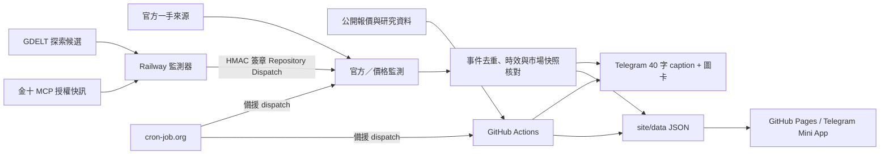

# PRStK Investment System

> 文件版本：2026-09-01｜本文件以 `main` 分支目前實際程式碼與 GitHub Actions 設定為準。

PRStK 是部署於 GitHub 的公開市場資訊整理、風險監測與量化研究系統。它以繁體中文產生 Apple Watch 友善的 Telegram 快報，並以 GitHub Pages 提供 Telegram Mini App 儀表板。

> 僅整理公開或已授權資料、模型研究及教育性風險觀察，不構成投資建議。本系統不讀取券商、銀行、錢包或其他私人帳戶，不要求密碼、OTP 或憑證，亦不會自動交易。

## 最近交付與驗收狀態（2026-09-01）

本版本已把即時通知、來源品質、發布安全與公開頁面驗收串回同一條
lineage；以下狀態以目前 `main` 的程式與 Actions evidence 為準：

| 交付 | 狀態 | 可追溯內容 |
|---|---|---|
| 即時價格／新聞／FinancialJuice 通知 lane | 已整合 | watchlist 門檻、provider funnel、canonical 風險與 Alert Budget 共用同一條事件流程 |
| Telegram 文字與圖卡安全 | 已整合 | release gate、單一訊息、逐收件人 retry、renderer 失敗即停止送圖；不寄黑色 placeholder |
| Pages／Mini App 公開版本 | 已驗收 | `ready` manifest、7/7 artifact hash、一致的 market／research／event snapshot，以及美股新聞頁與 release-bound deep link |
| Cloudflare Worker／Supabase 零成本路徑 | canary 可用 | Worker health 與 Supabase contract 已驗證；Railway 仍保留為可選 rollback |
| Gmail Watch 持久化 | 待補外部憑證 | Watch／Pub/Sub／Supabase 程式已存在，正式續期仍需要 OAuth client secret 與 refresh token；在補齊前不宣稱郵件事件正式接收 |

公開頁面的檢查結果、release ID、snapshot ID 與 hash 會記錄在
[`docs/evidence/postmerge-acceptance-2026-09-01.json`](docs/evidence/postmerge-acceptance-2026-09-01.json)。
這份 evidence 不包含 Bot token、OAuth secret、refresh token 或原始收件人識別碼。

## 服務範圍

- **Telegram 快報**：固定報告與符合門檻的速報；公開文字以彩色圓點搭配一個 canonical `R0`～`R4` 風險代碼與人類可讀狀態，caption 限制 40 字內，並附對應 Mini App deep link 按鈕。相同風險等級會同步保留在回執與稽核資料。
- **Telegram Mini App**：GitHub Pages 儀表板顯示完整市場卡、風控、研究清單、已核對事件與資料時間。
- **公開市場快照**：台股、日股、韓股、美股、半導體、能源、黃金與加密資產的公開報價、交易日與資料新鮮度。
- **重大事件流程**：官方一手來源、金十 MCP 授權快訊，及「多來源交叉核對」的探索訊號，皆經去重與市場資料核對才可能推播。
- **研究選股**：台美股的動能狙擊、三維共振、裸 K 結構與獨立璞玉價值池；結果僅是可重現的研究排序。
- **台股 Macro FGI**：以公開日資料計算台股市場情緒的五因子百分位模型。
- **可靠性機制**：GitHub Actions 主排程、cron-job.org Repository Dispatch 備援、推播去重、來源失敗隔離、Telegram 逐一送達重試。

## 這次整體增加了什麼

以下是從原本「單次抓資料」架構逐步整合到現在的能力。每一項都沿用同一條
資料、事件、發布與通知鏈，不另外建立平行的風險判斷或 Telegram 發送器；
「已整合」代表程式與離線契約已存在，「待驗證」則代表仍需要最新的外部
Pages／Worker／Telegram evidence 才能宣稱正式生產完成。

| 區域 | 已增加或整合的能力 | 主要落點與目前邊界 |
|---|---|---|
| 市場覆蓋 | 台股、美股、日韓、Nasdaq／費半、能源、貴金屬、美元與加密資產的公開行情 | `src/market_data.py`、freshness／mixed-data contract；逾時資料可觀察但不觸發高風險 |
| 新聞與來源 | TWSE／MOPS／SEC／Fed 官方來源，加上鉅亨、Yahoo Finance、Google News discovery；台美市場分流、provider funnel、來源健康與失敗原因 | `src/risk_news.py`、`src/news_intelligence.py`、`src/news_feed_adapters.py`；公開來源是 observation／待核對，不取代官方證據 |
| 事件生命週期 | observation、待核對、confirmed、escalated、deescalated、resolved，以及事件時間線與材料變化判斷 | `src/alert_lifecycle.py`、`src/event_ledger.py`、`site/app.js`；同一事件輪詢不重複轟炸 |
| 市場風險 | Macro Surprise、Market Regime、Contagion、Stress Scenario、Portfolio Risk、Market Impact Graph | 各因子、缺口、同步市場與資料品質可追溯；缺 expected／同步／新鮮度時保持 fail-closed |
| 研究系統 | 動能狙擊、三維共振、裸 K、璞玉價值四策略；Strategy Registry、Candidate Explainability、Advice Gate、Paper Portfolio、Event Feedback | 研究排序與事件觀察分離；母體不完整、掃描失敗與本輪無候選分開顯示，不產生交易指令 |
| Creator／財經內容 | Gmail Watch／Pub/Sub ingress、Creator 內容解析、FinancialJuice compound parser 與 vendor importance 優先級 | `railway-monitor/gmail_watch.py`、`src/financialjuice_*`、`src/external_*`；來源分數不改寫 PRStK risk，原始郵件不進公開頁面 |
| 發布安全 | release manifest、snapshot／artifact hash、schema validation、data-release、Pages release gate、last-known-good rollback | `src/release_gate.py`、`src/pages_release.py`、`.github/workflows/`；invalid／hash mismatch 不覆蓋公開版本 |
| Telegram 送達 | canonical text contract、Mini App deep link、Alert Budget、事件去重、逐收件人 retry、429 backoff、delivery receipt | `src/telegram_client.py`、`src/delivery_callback.py`；單一收件人失敗不阻塞其他人，也不輸出 token／原始 Chat ID |
| 零成本替代 | Cloudflare Worker、Supabase job／report／receipt contract、GitHub Actions worker；Railway 保留為 rollback | `worker/`、`supabase/`、`docs/zero-cost-production-migration.md`；正式切換仍以外部 canary evidence 為準 |

### 我們可以一起補強的地方

這些不是用文件掩蓋的「已完成」，而是目前架構下最值得優先改善的缺口：

1. **即時 watchlist 覆蓋**：把既有公開報價、EventLedger 與 Alert Budget 串成明確的
   watchlist 價格速報 lane，嚴格處理 1.50% 邊界、stale／delayed 與方向反轉。
2. **美股新聞可用性**：持續驗證 SEC／Fed 與 Yahoo／Google／鉅亨的 provider funnel，
   讓「本輪無事件」、「部分降級」、「來源失敗」在 Mini App 與 release 中一致。
3. **研究與即時事件解耦**：研究逾時只阻擋研究主張，不阻擋已通過來源與行情 gate 的
   即時事件；每一條通知仍必須有相應的 release 證據。
4. **外部正式 evidence**：完成 Pages 公開 manifest/hash、Cloudflare／Supabase canary、
   Railway rollback 與單一測試收件人的 Telegram receipt，並把 trace、release、snapshot
   串回同一條 lineage。
5. **可觀測性與回溯**：增加各 provider 的歷史成功時間、排除原因、通知預期／狀態與
   送達率摘要，但不暴露個人收件人或任何 Secret。

每次補強都必須先有 targeted test，再跑相關 regression、release audit 與 Mini App／
Telegram dry-run；外部服務未提供證據時，README 只標示「待驗證」，不把離線測試寫成
正式生產驗收。

## 目前功能總覽（2026-09-01）

這一節是系統能力的導覽，不把「程式已存在」誤寫成「外部服務已驗收」。凡是需要 Supabase、Cloudflare、GitHub Pages 或 Telegram 帳號設定的項目，仍以部署後的 release／delivery evidence 為準。

| 能力 | 現有架構中的落點 | 使用者可觀察的結果 |
|---|---|---|
| 台股、美股與全球市場 | `src/market_data.py`、官方交叉核對與 freshness contract | Mini App 顯示盤中、最近收盤、來源與資料狀態； stale／mixed data 不會被包裝成全即時 |
| 新聞與事件情報 | `src/risk_news.py`、`src/news_intelligence.py`、官方／公開／discovery provider funnel | 台股與美股分流；公開來源只能是 observation／待核對；官方失敗與本輪無事件分開顯示 |
| 事件生命週期 | `src/alert_lifecycle.py`、`src/event_ledger.py`、`site/app.js` | observation → pending confirmation → confirmed → escalated／deescalated → resolved；同一事件不因輪詢重複轟炸 |
| 總經與市場風險 | Macro Surprise、Market Regime、Contagion、Stress Scenario、Market Impact Graph | 顯示因子、缺口與連動市場；缺 expected、同步或新鮮資料時不產生保證式方向判斷 |
| 研究與候選 | 動能狙擊、三維共振、裸 K、璞玉價值；Strategy Registry／Explainability／Advice Gate | 候選、觀察、掃描失敗與部分母體分開；未通過 Advice Gate 不會產生買賣指令 |
| 發布與回溯 | `data-release`、release manifest、snapshot／artifact hash、Pages release gate | invalid 或 hash 不一致的 release 不會覆蓋公開版本；可回到上一個 last-known-good release |
| 通知與回執 | Telegram client、Alert Budget、逐收件人 retry、Railway／Worker receipt | 每次送出都有 trace、release、snapshot、policy 與結果；單一收件人失敗不阻塞其他人 |
| 即時覆蓋 | Watchlist 價格速報（絕對變動 >1.5%）、官方／公開新聞與 FinancialJuice ≥8 優先通知 | 共用 EventLedger、Alert Budget 與同一 release gate；stale／delayed／未核對資料只保留觀察 |
| 零成本替代路徑 | Cloudflare Worker + Pages、Supabase job/report contract、GitHub Actions worker | 可在既有 Railway 路徑旁執行 canary；Railway 保留為可選 rollback，直到外部驗收證據完整 |

### 各介面看到的內容

| 介面 | 公開呈現 | 不應期待的內容 |
|---|---|---|
| Telegram 文字 | 彩色圓點、一個 canonical `R0`～`R4`、事件／市場／狀態、最多 40 字、對應按鈕 | 不重複顯示風險代碼；不顯示未核對方向或虛構百分比 |
| Telegram 圖卡 | 僅限通過 renderer 與 release gate 的指定照片路徑；caption 與按鈕指向同一事件 | renderer 失敗時停止送圖，不寄出黑色／單色 placeholder |
| Mini App | 完整事件脈絡、來源 URL、published／fetched time、freshness、release lineage、事件時間線與研究狀態 | 不把來源失敗當成「本輪無事件」，不混用新舊 release；公開分析欄位可保留內部風險等級供稽核 |
| `/health`、delivery receipt | source health、classification、trace、成功／失敗數、重試與錯誤類型 | 不回傳 Bot token、原始 Chat ID 或其他 Secret |
| `site/data`／`data-release` | schema、provenance、snapshot、artifact hash 與品質狀態 | 不把 stale、未核對或不完整資料標成 confirmed／high-risk |

## 本次盤點與最近修正

以下是目前已落地、使用者最容易感受到的修正；它們也是閱讀本文件時應優先理解的行為：

- **台股／美股新聞分流**：台股與美股各自抓取，Mini App 以按鈕切換；每側最多 5 篇，編號由 1 重新開始。
- **新聞同題防呆**：若鉅亨兩個分類回傳相同或高度重疊的文章，系統會辨識為供應商快取／分類污染，改以台股與美股各自的 Google News RSS 探索查詢補抓；美股 fallback 使用 `en-US/US` locale，並在快取前排除台股／TWSE／TAIEX／0050 等跨市場標記。補抓結果會標示 discovery 來源。若補抓仍無法分流，美股清單會留空並顯示資料缺口，**不會把台股新聞偽裝成美股**。
- **新聞連結安全**：Mini App 只允許 `https://news.cnyes.com` 與 `https://news.google.com`，其他網址只顯示為不可開啟，避免把不明連結直接交給 Telegram WebView。
- **璞玉價值狀態透明化**：台股 MOPS 歷史資料採分批快取；未完成個股不列入，已完成個股可先產生正式候選或觀察名單，整體仍標示「歷史核對中」，且不沿用上一輪舊資料。TWSE 的 ROE／淨利／本益比是補充欄位，不會阻擋已完成六項歷史規則的台股；自由流通週轉率在沒有官方 free-float 欄位時，會透明標示採 Yahoo `floatShares`／`sharesOutstanding` 公開股數代理計算，不把代理值誤稱為 TWSE 官方數字。
- **報價與來源可追溯**：市場卡保留來源、報價／抓取時間、盤中或最近收盤、交叉核對狀態；逾時資料仍可顯示，但必須標示「最近收盤」，不可被價格警報使用。
- **Telegram 顯示與內部稽核一致**：所有非 Creator 文字通知在送出邊界正規化為一個 canonical `R0`～`R4`，並與彩色圓點、人類可讀狀態同時呈現；同一等級也寫入 delivery receipt、release lineage 與 Mini App 稽核欄位，避免重複或遺失風險上下文。
- **零成本路徑可回滾**：Cloudflare Worker／Pages、Supabase job contract、Gmail Watch renewal 與 GitHub Actions worker 已有正式契約與離線驗證；在外部 canary 證據完整前，Railway 不刪除且維持可選 rollback。
- **頁尾與 Mini App 入口**：頁尾為 `@2026 PRStK Lab & D.INV | All right reserved.`；Telegram 快報按鈕為「📡 開啟稜量速報系統」，固定選單為「稜量系統」。

## 一頁式使用流程

1. **先看 Telegram 短訊息**：只把「彩色圓點＋一個 R0～R4｜事件類型｜市場方向｜變動幅度｜狀態」送到手錶／手機，最多 40 字；完整證據留在圖卡與 Mini App。
2. **點擊 `📡 開啟稜量速報系統`**：在 Telegram 內開啟 GitHub Pages Mini App，閱讀四段事件脈絡、來源 URL、交叉核對時間、研究候選與資料健康度。
3. **先看來源健康狀態**：區分「本輪無重大事件」與「部分來源失敗」；看到資料缺口時，不把空白或舊候選解讀成市場沒有訊號。
4. **再看市場脈動**：先看台指／台積電與全球指數，再看 TPEx、日韓、Nasdaq、費半、BTC／ETH 等卡片的來源與新鮮度。
5. **最後看研究**：在台股／美股切換後展開四個策略抽屜。不同策略分數不可互比，也不是買賣建議。

Mini App 是靜態快照，不會因為「重新整理」就直接連到交易所。要取得新資料，必須等待或手動執行對應的 GitHub Actions；完成 Pages 部署後，Telegram 按鈕的版本參數會協助避開 WebView 快取。

## 系統架構



## 資料更新、掃描與推播時間

所有時間均為台灣時間（UTC+8）。GitHub Actions 與 cron-job.org 都可能延後執行，因此「時間」是目標排程，不是交易所逐筆行情承諾。每個定時快報會先刷新公開市場資料、再寫入 `site/data/market.json`、發 Telegram、部署 Mini App。

| 類別 | 目標時間／頻率 | 工作內容 |
|---|---|---|
| 晨報 | 工作日 06:00 | 隔夜市場、總經／風險脈絡與代表標的公開快照 |
| 台股時段快報 | 工作日 08:45、10:00、11:45、13:15 | 優先檢視台指／台股盤勢與其連動市場 |
| 全市場量化研究 | 工作日 13:30 | 掃描台美研究母體；工作流程最長容許 55 分鐘 |
| 盤後速報 | 工作日 14:45 | 刷新研究結果後的台股盤後摘要與 Mini App |
| 美股盤前 | 工作日 21:00，全年固定 | 台股回顧、美股盤前與國際風險快照 |
| 官方／價格訊號 | 工作日每 5 分鐘 | 官方事件候選與固定價格門檻；只有符合規則才推播 |
| 金十 MCP | Railway 預設每 120 秒 | 已授權 `list_flash` 快訊去重與簽章觸發；同一事件統一 30 分鐘冷卻 |
| GDELT 交叉核對 | Railway 預設每 15 分鐘 | 只作候選線索；需兩個可信媒體網域與同一事件錨點才可觸發 |

市場休市或公開來源未提供新盤中列時，系統保留最近可核對收盤並標示資料日期／狀態；延遲報價不應觸發價格速報。Mini App 是靜態 Pages：它在「資料刷新或事件推播成功後」更新，不會因使用者單純開啟頁面而自行向交易所重新取價。

## 重大事件與快訊規則

### 來源層級

| 層級 | 來源 | 用法 |
|---|---|---|
| 一手官方 | Fed、BLS、BEA、EIA、SEC EDGAR、TWSE、MOPS、TAIFEX、中央銀行、金管會、主計總處、經濟部、USGS、GDACS、CISA、WHO 等 | 直接進入候選事件流程；只有新鮮且重大者才送出 |
| 已授權快訊 | 金十 MCP | Railway 僅讀取授權 `list_flash`；事件 ID 去重後以 HMAC 簽章送入 GitHub |
| 探索／交叉核對 | GDELT 聚合的 Reuters、AP、Bloomberg、FT、WSJ、NYT、BBC、CNBC、Nikkei 等可信網域 | 不是直接新聞爬蟲或單一來源觸發器；同類事件必須至少兩個不同可信網域、同一具體錨點才可能送入 GitHub |

GDELT 首次成功讀取只建立基線，不補發舊聞；成功快取 15 分鐘，暫時失敗或限流時最多使用 120 分鐘內的最近成功快取並標示時間，不採繞過限流。探索候選必須由至少兩個可信網域共享同一人物／地點／動作交集；黑天鵝仍須一手官方來源確認。官方來源或探索來源失敗不會使其他來源改用舊資料推播。

市場新聞是另一條「閱讀用」來源鏈：鉅亨台股／美股分類為主要來源；若兩側文章集合重疊達 80% 以上，會各自改查 Google News RSS（台股查台股／台積電／半導體，美股以 `en-US/US` 查美股／Nasdaq／Nvidia／Fed）。RSS 只作發現線索，不等同官方核實；重大事件仍要回到官方來源或第二可信網域。所有文章在寫入快取前都會做市場語意過濾，避免供應商回傳錯誤分類造成台美新聞相同。

### 重大性與價格門檻

| 類別 | 事件或變動門檻 | Mini App 核對重點 |
|---|---|---|
| 官方總經／政策 | FOMC、CPI、PCE、非農、GDP、重大關稅／出口管制／制裁等新鮮且方向性公告 | 美債、美元、Nasdaq、費半、台股科技 |
| 地緣／能源／黑天鵝 | 戰爭、停火、重大供應中斷、USGS／GDACS 等級事件；能源需有供給或地緣脈絡 | WTI／Brent、黃金、美元與主要股市 |
| 半導體／權值 | 台積電、NVIDIA、ASML 等的方向性財報、展望、資本支出或出口管制 | 費半、Nasdaq、台股電子權值 |
| 重要正向事件 | 可核對的停火、和平、關稅豁免、降息等具廣泛影響事件 | 相關股市、利率、商品與風險偏好 |
| 日內價格 | 台指日變動 1.5%、費半 3%、Nasdaq 2%、WTI／Brent 5%；15 分鐘變動台指／費半／Nasdaq 1%、油價 2% | 該標的與至少兩個相關市場的可核對報價 |

工作日 08:45–13:30 的價格速報優先台指／台股盤勢。單一商品或加密資產的日內變動通常只更新 Mini App；只有已核對的重大政策、總經、戰爭或重要公司事件才會取代台股優先訊號進入短訊息。

同一事件以 canonical key、來源 URL 正規化及人物／地點／動作指紋去重；Jin10、GDELT、官方事件與事件帳本統一採 30 分鐘冷卻，只有風險升級或新事實可提前提醒。台指高風險／高波動狀態仍必須有新鮮報價、風險階段跨越或明顯反轉。所有詳細內容採「事件／為何重要／可能連動／股市觀察」四段結構，明示教育性用途，沒有買賣、目標價、進出場或部位指令。

## 量化研究策略

所有策略皆以已完成的公開日 K／公開財務資料輸出；不同策略的分數**不可互相比較**，也不代表報酬機率或保證。

### 1. 動能狙擊（Kinetic Sniper）

這是右側、順勢的價格與波動相對排名。先以「收盤價不低於 5 日均線」作為硬性防守濾網，再於可投資流動性的母體內計算百分位加權分數，取前 5 名。

| 特徵 | 權重 | 研究含義 |
|---|---:|---|
| 20 日年化歷史波動率 | 29.08% | 價格活性與波動擴張 |
| 布林通道寬度 | 19.33% | 收斂後擴張的價格環境 |
| 相對 60 日均線乖離 | 10.39% | 中期趨勢位置 |
| 5／60 日均線發散 | 7.67% | 短中期趨勢強度 |
| 相對 20 日均線乖離 | 7.26% | 月線位置 |
| 相對布林上軌 | 5.09% | 強勢區間位置 |
| 10 日 ROC | 4.25% | 近兩週絕對動能 |

另標示 VCP 收斂突破（近 5 日振幅相對前期收斂、突破 20 日高點、量能至少為 20 日均量 1.2 倍）、量能放大與 3／5／20 日新高。台股動能研究另設每日成交額至少 **3,000 萬元**的流動性門檻；美股研究以公開大型股母體與最低成交額過濾。此處是研究排序，不是進場訊號。

### 2. 三維共振（3D Resonance）

這是左側、以公開日線尋找「恐慌／中性區的聰明錢痕跡」的研究模型。個股 FGI 必須小於 56，再依下列四項條件篩選：四項全符合優先；當日無四項時，才顯示符合三項的備選，最多 5 名。

| 優先順序 | Smart Money 條件 | 公開日線定義 | 權重 |
|---:|---|---|---:|
| 1 | 爆量吸收／長下影 | 成交量 ≥ 20 日均量 1.2 倍，或下影線 > 實體 1.5 倍 | 35 |
| 2 | 跌破前低後收回 | Low < 前一日 Low 且 Close > 前一日 Low | 30 |
| 3 | 相對大盤 Alpha > 0 | 當日個股報酬大於對應大盤 | 20 |
| 4 | 波動率擴張 | True Range > 14 日 ATR × 1.1 | 15 |

個股 FGI 的研究組成為價格位置（Bias／RSI）20%、波動與布林位置 20%、五日資金流代理 35%、量能／周轉代理 25%。畫面會顯示實際符合的橘色條件，避免將未符合條件包裝為訊號。

### 3. 裸 K 結構（Price Action）

裸 K 只在回檔結構邊緣研究，不追逐剛突破的噴發 K：當日收盤必須低於前 5 日高點，且下影線大於 ATR 的 10%。歷史轉折點採至少 5 根後續已完成 K 線確認，避免將尚未定型的當日高低點當成結構。

| 型態 | 公開量化條件 | 結構相符度基礎分 |
|---|---|---:|
| 撐壓互換回踩 | 已帶量突破前高後，回踩前高附近且收盤守住前高實體上緣 | 70 |
| 雙底右腳確認／區間邊界 | 兩個已確認低點差距不超過 2%，當日回踩並守住邊界 | 70 |
| 假跌破收復（Spring） | 盤中低於已確認支撐低點，收盤收回支撐之上 | 85 |
| 嚴格訂單塊回踩 | 爆量黑 K（≥20 日均量 1.5 倍）後接強勢陽線，且首次回踩區間守住並有下影線 | 80 |

多型態同時成立，每多一項加 5 分，最多加 15 分；排序先看結構相符度，再看成交額。ATR 與結構邊界僅保留於獨立研究／回測，不會在 Mini App 變成交易指令。

### 4. 璞玉價值（獨立公開基本面池）

價值研究不從其他三種技術策略回頭挑股。台股母體為 **0050 + 0051** 的最新公開 PCF／持股表，美股母體為 **Vanguard VOO** 官方持股表。

| 市場 | 基本面來源 | 覆核條件 |
|---|---|---|
| 台股 | TWSE OpenAPI 最新財報／本益比，加上 MOPS 歷史 EPS 與股利公告 | 六項條件中至少 5 項且資料完整才列正式候選；ROE、淨利、本益比僅作補充評分，不是硬性門檻 |
| 美股 | SEC EDGAR CompanyFacts 與 VOO 官方持股表 | 最近可得年度淨利至少 5 億美元、ROE、現金股利／配息與本益比等公開欄位 |

璞玉價值採六項條件：最近三年 EPS 每年為正、最近四季 EPS 每季為正，以及近三個月平均成交金額、平均成交股數、自由流通週轉率、三個月漲幅均不在市場前 10%。正式候選需完整資料且至少 5/6（最多 5 檔）；觀察名單需完整資料且為 3/6 或 4/6（最多 5 檔）。ROE、淨利、本益比只作補充評分；MOPS 歷史建檔期間僅排除尚未完成的個股，已完成個股仍可評估。

### 台股 Macro FGI

TAIEX Macro FGI 是台股市場風險偏好的公開日資料模型，不是個股買賣評分。資料使用 `^TWII`、`^TWOII` 與 `TWD=X` 的兩年日資料，並在每項的最近 120 個交易日歷史中計算百分位。

| 因子 | 權重 | 高分含義 |
|---|---:|---|
| 加權指數相對 125 日均線乖離 | 30% | 市場動能偏高 |
| 20 日歷史波動率（反向） | 20% | 波動較低、風險偏好較高 |
| 櫃買／加權相對強度 | 20% | 內資投機熱度偏高 |
| 美元兌台幣 20 日變化（反向） | 15% | 台幣相對走強、外資風險偏好較高 |
| 加權成交量相對 20 日均量 | 15% | 量能熱度偏高 |

分級固定為：75 以上極度貪婪、56–74.9 貪婪、45–55.9 中立、26–44.9 恐慌、低於 26 極度恐慌。任一必要資料不足 120 個交易日或下載失敗時，系統顯示「資料暫時無法取得」，不以舊分數替代。

## 可靠性、安全與部署

### Zero-cost async report path（並行、可回滾）

報告產生已提供不依賴 Railway 的契約骨架：Cloudflare Worker 負責 Telegram
WebApp 驗證、Supabase job CRUD、GitHub Actions dispatch 與 Telegram proxy；
重量級行情／研究運算仍由 GitHub Actions 執行，Cloudflare Pages 只負責 Mini
App 與輪詢。設定與回滾步驟請見
[zero-cost production migration](docs/zero-cost-production-migration.md)；
[migration inventory](docs/migration-inventory.md) 會記錄尚未完成的外部驗收。

這條路徑的程式契約、migration、Worker API、Gmail Watch renewal 與 Actions
工作流程已在 repository 中提供；是否可宣稱正式切換，仍要以 Supabase／Worker／Pages
公開驗證及單一 Telegram canary 的可追蹤 evidence 為準。在所有外部 gate 通過前，
Railway 保持為 rollback 路徑，不刪除既有資料，也不把離線測試誤寫成生產驗收。

- GitHub Actions 的 `scheduled-brief` 以時段鍵和 Cache 防止主排程與 cron-job.org 重複發 Telegram。
- `official-event-monitor` 與定時快報使用 Pages 併發鎖，市場快照回存失敗會嘗試 rebase 後重送 3 次。
- Railway 將已見事件、已發送分類冷卻與探索快取保存在 SQLite；GitHub 仍會驗證外部快訊 HMAC 簽章與允許來源。
- Telegram 逐一處理收件人。未對 Bot 按 Start、封鎖 Bot 或單一收件人失敗，會記錄且不阻塞其他收件人、快照提交與 Pages 部署。
- `.env`、GitHub Actions Secrets 與 Railway Variables 僅可保存憑證，絕不可提交到 Git。外部來源僅限公開／已授權 API，禁止爬取受限網站或繞過速率限制。

### cron-job.org 備援

cron-job.org 可透過 GitHub Repository Dispatch 備援定時快報、量化研究與 **Official macro and price monitor** 官方／價格檢查。其事件類型為 `official-event-check`；外部請求只觸發工作流程，是否送出仍取決於 GitHub 的時段／事件去重鎖。完整 Header、payload 與 slot 設定請見 [金十 Token 與外部快訊安全設定](docs/JIN10_RAILWAY_SETUP.md)。

## 設定總表（哪些值放在哪裡）

任何 Token、API key、Chat ID 都不要寫入 `README`、前端、commit、Issue 或 Telegram。公開文件只描述**變數名稱**：

| 變數 | 放置位置 | 用途 | 必要性 |
|---|---|---|---|
| `TELEGRAM_BOT_TOKEN` | GitHub Actions Secret／本機 `.env` | Telegram Bot API | 發送 Telegram 時必要 |
| `TELEGRAM_CHAT_IDS` | GitHub Actions Secret／本機 `.env` | 逗號或換行分隔的多人收件人 | 發送 Telegram 時必要 |
| `DASHBOARD_URL` | GitHub Actions Variable／本機 `.env` | Mini App HTTPS 網址 | 發送帶按鈕的快報時必要 |
| `FRED_API_KEY` | GitHub Actions Secret；需要時共享給 Railway Service | FRED 公開總經資料 | Phase 2；缺少時標示缺口 |
| `EIA_API_KEY` | GitHub Actions Secret；需要時共享給 Railway Service | EIA 石油資料 | Phase 2；缺少時標示缺口 |
| `JIN10_MCP_TOKEN` | Railway Service Variable | 金十官方 MCP `list_flash` | Railway 監測器才需要 |
| `GITHUB_DISPATCH_TOKEN` | Railway Service Variable | 觸發 Repository Dispatch 的 fine-grained PAT | Railway 監測器才需要 |
| `EXTERNAL_ALERT_SHARED_SECRET` | GitHub Secret＋Railway Service Variable | 驗證外部 HMAC | Railway 監測器才需要 |
| `GITHUB_REPOSITORY` | Railway Service Variable | `owner/repository` | Railway 監測器才需要 |
| `RAILWAY_STATUS_URL` | GitHub Actions Variable | Railway 公開服務根網址 | 選用；回寫 Telegram 派送回執 |
| `RAILWAY_STATUS_SHARED_SECRET` | GitHub Actions Secret＋Railway `DELIVERY_STATUS_SHARED_SECRET` | 驗證派送回執 HMAC | 建議啟用 |

多人推播只維護 `TELEGRAM_CHAT_IDS`；程式刻意不讀取舊的單數 `TELEGRAM_CHAT_ID`，避免新增／移除成員時被舊設定覆蓋。每位收件人必須先對 Bot 按 **Start**；未啟動、封鎖 Bot 或單一 Chat ID 失敗時，其他收件人仍會繼續收到。

每次派送都有 Trace ID。Actions 會輸出 `delivery_status`、成功／失敗數與失敗收件人雜湊；暫時性錯誤只重試失敗收件人，HTTP 429 遵守 Telegram `Retry-After`。Railway Volume 的 SQLite `delivery_outbox` 保存來源事件到 GitHub 的派送狀態；設定上述回執變數後，Actions 會以 HMAC 回寫 `/delivery-status`，保存逐收件人失敗雜湊。回執不包含 Bot Token 或原始 Chat ID。所有收件人都失敗時，工作步驟會明確失敗且不建立事件成功鎖。

## GitHub Actions 操作手冊

| Action | 何時使用 | 會不會送 Telegram |
|---|---|---|
| **Refresh market dashboard** | 只想重新抓行情、修正 Mini App 快照 | 否 |
| **Scheduled market brief** | 測試晨報／盤前／盤中／午報／午盤／盤後／美股盤前 | 是；測試時才使用 `force` |
| **Official macro and price monitor** | 立即檢查官方事件與價格門檻 | 只有新事件或新價格級距且通過去重才會送 |
| **Unified Taiwan-US research report** | 全市場量化掃描；正式排程為工作日 13:30 | 否，會更新研究與行情快照 |
| **Configure Telegram Mini App** | 首次設定或變更 Bot 選單 | 否 |
| **Four-strategy walk-forward backtest** | 使用 point-in-time 資料驗證策略 | 否，僅產生回測報告 |

建議驗證順序：先跑 `Refresh market dashboard`，確認 `site/data/market.json` 有新的 `updated_at`；再跑研究工作流程，確認研究報表狀態；最後才用 `Scheduled market brief` 的 `force=true` 測試 Telegram。不要用重複的 slot 反覆 force，否則會刻意繞過同時段防重複鎖。

## 快速驗收指令

```powershell
git clone https://github.com/hanjhou2000716/prstklab-stk-detector.git
cd prstklab-stk-detector
python -m venv .venv
.\.venv\Scripts\Activate.ps1
pip install -r requirements.txt
Copy-Item .env.example .env       # 僅本機測試，勿提交
python -m pytest -q
```

常用唯讀指令：

```powershell
python -m src.refresh_market_data
python -m src.run_research_report
python -m src.official_event_monitor --write-status
python -m src.scheduled_brief --slot pre_open --print-window
```

本機快報要真的送出，`.env` 需有 `TELEGRAM_BOT_TOKEN`、`TELEGRAM_CHAT_IDS`、`DASHBOARD_URL`；研究與行情指令不需要交易帳戶。若只想檢查輸出，先不設定 Token，系統應明確回報「未設定 Telegram」，而不是假裝已送達。

## 第 4～6 階段：事件帳本、行情核對與通知輸出（2026-08）

### 第 4 階段：事件去重與永久帳本

事件不再只依賴 GitHub Actions Cache。`site/data/event-ledger.json`（Railway
可改用 `EVENT_LEDGER_PATH` 指向持久化 Volume）保存至少 30 天的
`canonical_key`、正規化來源 URL、人物／地點／動作指紋、首次發現時間、最近提醒時間、
升級狀態與已核對來源。相同事件即使換了新聞網址或快取被清除，也會沿用同一事件身份；
只有升級為更高風險時才可繞過一般冷卻時間。

### 第 5 階段：市場交叉核對

行情資料契約固定輸出「來源｜報價時間｜盤中／最近收盤｜是否已交叉核對」。來源配對為：
台股 TWSE／TAIFEX、TPEx／TWSE MIS 備援、美股 Yahoo／另一公開市場來源、BTC／ETH
Binance／CoinGecko、油價／黃金 Yahoo／EIA 或公開市場來源、VIX Yahoo 歷史資料／可取得的官方資料。
次要來源缺漏、時間未對齊或價差超過門檻時，保留行情卡但標示未核對，且不升級高風險快報。

### 第 6 階段：輸出與通知品質

市場風險快訊與市場定時報告固定使用四段：**事件、為何重要、可能連動、股市觀察**；
每輪最多四個主題。Telegram Apple Watch 短訊息只保留「事件類型｜市場方向｜變動幅度｜狀態」，
以彩色圓點提示風險層級；完整來源 URL、核對網域、事件／核對時間、交叉核對市場與傳導說明放在 Mini App。
輸出固定附上「僅供公開資訊整理與教育性觀察，不構成投資建議」。

詳細欄位與範例見 [第 4～6 階段事件、行情與輸出規格](docs/PHASES_4_TO_6_EVENT_MARKET_OUTPUT.md)。

## 目前限制與下一步（誠實邊界）

下列項目是目前系統的真實邊界，並非已完成的功能；優先度由高到低排序。

1. **行情來源一致性（中）**：台股已具備 TWSE／TAIFEX／TPEx 交叉核對欄位；美股、商品與加密資產仍可能受公開來源延遲影響。卡片會保留來源時間並標示未核對，後續可再補第二公開來源。
2. **事件可追溯性（已完成第一版）**：事件帳本、來源 URL／網域、核對時間與市場同步核對已寫入快照及 Mini App；仍可增加歷史查詢頁與排除原因統計。
3. **跨來源同題誤配（已完成第一版）**：GDELT 仍只作線索，須有可信網域與人物／地點／動作交集；黑天鵝仍要求一手官方確認。後續可增加更多語意相似度測試。
4. **來源健康可視化（中）**：Mini App 已有可收合來源健康卡，會區分「本輪無重大事件」與「部分來源失敗」；目前仍可再增加各來源最後成功時間、失敗原因、候選數與延遲的歷史查詢頁與告警摘要。
5. **排程延遲與寫入競爭（中高）**：GitHub cron 不保證準時，且定時快報、研究、事件監測都可能回存同一份快照。現有併發鎖與三次 rebase 重試能降低衝突，但建議改採版本化快照／單一資料發佈工作流程，並記錄每次刷新 ID。
6. **研究可驗證性（中高）**：策略分數已可重現，但尚未形成完整的跨市場、含存活者偏差、停牌、除權息、手續費與滑價的 walk-forward 成效報告。建議先建立不改策略參數的固定樣本期與月度檢定，再決定是否調整門檻。
7. **成分股與財務資料的新鮮度（中）**：0050／0051／VOO 成分與財報發布存在更新週期、欄位缺漏或網站結構變化。建議保存每次母體快照、申報期、資料覆蓋率與缺失名單，避免把資料不足誤解為不符合價值條件。
8. **首輪基線與狀態持久化（已完成第一版）**：官方與探索來源仍會建立首輪基線避免舊聞洗版；事件帳本現在可提交到 GitHub 快照，Railway 可用持久化 Volume 保存，Actions Cache 僅作短期備援。
9. **Telegram 送達稽核（中）**：目前能隔離單一收件人失敗，但尚無可讀的日／週送達率、重試次數與未啟動名單摘要。建議增加不含個人內容的送達健康報告。
10. **Mini App 更新模式（中）**：Pages 是靜態部署，開啟頁面不會即時拉行情。若未來需要「開啟即刷新」，需另建不含私密憑證的後端快照 API、CORS／快取策略與資料延遲保護，而不是讓前端直連交易來源。

## 常見狀況排查

### Mini App 看起來沒有更新

1. 到 Actions 先看最新的 **Refresh market dashboard** 或 **Scheduled market brief** 是否為綠色。
2. 打開 workflow log，確認 `refresh_market_data` 完成且 `site/data/market.json` 有新的 `updated_at`。
3. 確認 Pages 部署成功；Telegram 的按鈕會附版本參數，直接複製舊網址可能仍受瀏覽器快取影響。
4. 若來源本身休市或超過新鮮度門檻，卡片會保留數值但標示「最近收盤」，不是抓取失敗。

### 研究清單為空或顯示「歷史核對中」

- 「本次無研究候選」代表掃描成功但沒有達到該策略門檻；這與「掃描失敗」不同。
- 台股璞玉價值採逐檔 MOPS 分批歷史建檔。尚未完成六項條件所需資料的個股會排除；已完成個股仍可產生候選，報表同時顯示整體建檔進度。
- 研究資料超過 30 小時（`research_report` 的 freshness gate）會視為逾時，Mini App 不沿用上一輪候選。
- 檢查 Actions 的 `台股品質價值覆核`、`美股品質價值覆核` 以及 Artifact 中的 `*-value-summary.json`；先修資料來源，再調整批次或重跑，不要把門檻改寬來掩蓋缺口。

### 台股／美股新聞重複

這是供應商分類快取污染的可預期故障模式。PRStK 會先以文章 URL 集合比對；重疊達 80% 時分別查 Google News RSS。若 RSS 仍失敗，保留可辨識的資料缺口並清空重複的一側。請看 `market.json` 的 `news.diagnostics`、`news.source_health`，不要手動複製台股文章到美股頁籤。

### 收到 GitHub 綠勾但沒有 Telegram

檢查三件事：`TELEGRAM_BOT_TOKEN` 是否仍有效、`TELEGRAM_CHAT_IDS` 是否包含收件人且以逗號／換行正確分隔、每位收件人是否曾按 Bot 的 **Start**。另外，官方事件與價格訊號即使 workflow 成功，也可能因「沒有新事件、未跨過級距、來源未交叉核對或仍在冷卻」而安全跳過推播；完整原因會寫在 workflow log 與 Mini App 事件卡。

### Railway 監測器看不到新事件

確認 Service 已部署且 `/health` 可開啟；`jin10`／`gdelt` 需各自顯示最近成功時間與 item count。`JIN10_MCP_TOKEN` 權限、`GITHUB_DISPATCH_TOKEN` 的 repository scope、HMAC 共用密鑰三者任一錯誤，都會只記錄來源失敗，不會繞過 GitHub 驗證。建議在 Railway 掛載 `/data` Volume，讓 SQLite 事件帳本與 GDELT 快取跨重啟保留。

## 程式與資料檔案地圖

| 路徑 | 責任 |
|---|---|
| `src/market_data.py` | 公開行情、台股／加密／海外交叉核對、freshness 與最近收盤標記 |
| `src/risk_news.py`、`src/news_intelligence.py`、`src/news_feed_adapters.py` | FGI、VIX、台美新聞、provider funnel、Cnyes／Google／Yahoo／SEC／Fed 分流與來源健康 |
| `src/event_alerts.py`、`src/official_event_monitor.py` | 價格級距、重大事件四段內容、官方確認與市場同步升級 |
| `src/event_ledger.py` | canonical key、URL／人物／地點／動作指紋、30 天帳本 |
| `src/scheduled_brief.py` | 時段解析、台股優先、40 字 caption 與同時段防重複 |
| `src/momentum_*`、`src/taiwan_momentum_scan.py` | 動能狙擊與台股成交額門檻 |
| `src/resonance_*` | 三維共振與 Smart Money 四項條件排序 |
| `src/price_action.py` | 四種裸 K 結構與嚴格訂單塊 |
| `src/pristine_value.py`、`src/mops_history.py`、`src/value_universe.py` | 璞玉價值六項規則、0050＋0051／VOO 母體、MOPS 分批快取 |
| `src/source_health.py`、`src/research_report.py` | 研究逾時、資料缺口、掃描失敗與「本次無候選」分流 |
| `src/telegram_client.py`、`src/financialjuice_notification.py` | Telegram 顯示清理、40 字限制、FinancialJuice 來源標記與送達回執 |
| `src/alert_card_renderer.py`、`src/release_gate.py`、`src/pages_release.py` | 1080×1350 圖卡、renderer fail-closed、manifest／hash／Pages 發布閘門 |
| `worker/src/index.ts`、`supabase/migrations/` | 零成本 job／report API、Gmail Pub/Sub ingress、驗證與 Supabase 持久化契約 |
| `site/index.html`、`site/app.js`、`site/styles.css` | Telegram Mini App UI、卡片、來源追溯與市場切換 |
| `railway-monitor/app.py` | 金十 MCP／GDELT 輪詢、事件去重、HMAC Repository Dispatch、`/health` |
| `site/data/market.json` | Mini App 最新公開快照；非交易資料庫 |
| `site/data/event-ledger.json` | GitHub 端可審計事件帳本；Railway Volume 可作主要持久化 |

## 最終安全邊界

本專案只讀取公開或已授權的市場資料，提供風險教育、事件整理與可重現研究排序；不登入券商／銀行／基金／錢包，不要求密碼、OTP、API key，不執行下單、申購、贖回、扣款、轉帳或自動交易。任何快訊、分數、候選名單、FGI、VIX 分級與回測結果，都不能單獨視為投資建議或未來績效保證。

## 本機測試與操作文件

```powershell
python -m venv .venv
.\.venv\Scripts\Activate.ps1
pip install -r requirements.txt pytest
python -m pytest -q
```

本機 `.env` 只保存 `TELEGRAM_BOT_TOKEN`、`TELEGRAM_CHAT_IDS`（逗號分隔）與 `DASHBOARD_URL`；GitHub 使用 Actions Secrets／Variables，Railway 使用 Service Variables。每位 Telegram 私人聊天室收件人必須先對 `@PRStK_Lab_bot` 按 **Start**。

- [Telegram Mini App 設定](docs/MINI_APP_SETUP.md)
- [Railway 金十監測器部署](docs/RAILWAY_MONITOR_DEPLOY.md)
- [金十 Token 與外部快訊安全設定](docs/JIN10_RAILWAY_SETUP.md)
- [Beta 操作說明](docs/BETA_OPERATION_GUIDE.md)
- [Beta 驗收清單](docs/BETA_ACCEPTANCE.md)
- [四策略固定樣本期 Walk-forward 回測](docs/WALK_FORWARD_BACKTEST.md)
- [歷史回測資料匯入與稽核](docs/BACKTEST_ARCHIVE_SETUP.md)

## 目前採用規格（2026-08）

### 研究資料狀態

研究報表會區分「可用」、「本次無研究候選」、「部分缺漏」、「掃描失敗」與「建檔中」。掃描失敗或資料逾時時，Mini App 不沿用上一輪候選清單；只有最新一輪成功產生的資料才會顯示為研究候選。

### 璞玉價值（六項制）

台股池採 0050＋0051 成分股，使用 TWSE／MOPS 公開資料與近三個月公開行情。

- 品質條件：最近三年 EPS 每年為正、最近四季 EPS 每季為正。
- 去熱門化條件：近三個月平均成交金額、平均成交股數、自由流通週轉率、近三個月漲幅，均不得位於母體前 10%。
- 正式候選：至少符合 5/6，最多 5 檔。
- 觀察名單：完整資料且符合 3/6 或 4/6，最多 5 檔。
- MOPS 歷史資料採分批快取；未完成個股不列入，已完成個股可在整體建檔完成前列入正式候選或觀察名單。
- ROE、淨利、本益比僅作補充評分，不是六項硬性門檻。

### 市場資料

TPEx 固定顯示中文註釋「臺灣上櫃指數」。台股盤中資料優先使用 TWSE／TAIFEX／TPEx 官方交叉核對；海外與其他資產顯示來源及報價時間，逾時資料保留卡片並標註「最近收盤」。

## Phase 1 data contract and provenance audit (2026-08)

All event records now carry a shared provenance contract: `source_tier` (`official`, `public-market`, or `discovery`), fetch and publication timestamps, event type, importance, source URL/domain, cross-check status, and an explicit `data_gap` field. Quote records likewise carry source tier, fetch/quote time, source domain, and `stale_used`; a delayed or recent-close quote remains visible but is never presented as live.

The official-event collector records per-source health, item count, latest publication time, and failure type. A single provider failure is isolated and surfaced in Mini App source health instead of suppressing the whole scan. Event and quote records are retained as public read-only observations and are not trading instructions.

SEC requests identify this project with the repository URL in the User-Agent and remain limited to the semiconductor/AI watchlist plus NASDAQ-100. The event ledger is designed for Railway persistent storage; GitHub Actions Cache is only a short-term backup. Phase 2 added KOFIA, BTC/ETH MACD, FRED and EIA; Phase 3 now enables the GDELT discovery and cross-check gate described below.

## Phase 2 public macro and crypto sources

The monitor now connects independently to KOFIA Korea-wide credit financing, Binance public BTC/ETH weekly and monthly candles (MACD 12/26/9), FRED observations, and EIA petroleum spot data. Each provider returns an explicit health record; missing `FRED_API_KEY` or `EIA_API_KEY` is reported as a data gap rather than silently using stale values. Setup steps are in [docs/FRED_EIA_API_SETUP.md](docs/FRED_EIA_API_SETUP.md). GDELT automatic discovery is enabled as a discovery layer only: two trusted domains must share a concrete person/place/action anchor, and black-swan candidates still wait for a first-party official confirmation.

### Phase 3: GDELT discovery and cross-check gate

The Railway monitor polls the public GDELT DOC endpoint every 15 minutes by default. A successful response is cached for 15 minutes; during a temporary failure or rate limit, the most recent successful cache may be used for up to 120 minutes and is labelled with its original fetch time. Only discovery articles published within the last 45 minutes can enter the current candidate set. Set `GDELT_DISCOVERY_ENABLED=false` to pause this layer without disabling official monitors.

GDELT is never treated as final proof. A candidate must have at least two trusted publisher domains and a shared concrete entity/place/action intersection. Black-swan, war and major-disaster candidates are not dispatched from GDELT alone; they require a matching first-party official source and related-market synchronization. The first successful poll creates a baseline and does not replay historical headlines; the existing SQLite ledger applies event deduplication and the shared 30-minute cooldown.
GDELT 交叉核對會同時使用可取得的標題與摘要／描述欄位；伊朗／川普談判事件補充 `talks`、`negotiations`、`deadline`、`談判`、`未談妥`、`談判破裂` 等動作別名，避免標題只有「美國與伊朗局勢」而把實際事件內容遺漏。
涉及貝森特／Bessent、日圓／yen、日本央行／BOJ、匯率干預與聯準會支持的宏觀事件也納入 GDELT 查詢與事件錨點。只有單一可信來源或尚未形成共同人物／地點／動作證據的候選，會在 Railway `/health` 的 `gdelt.pending_count` 與 `pending_reasons` 標示為待核對，不會靜默丟棄，也不會繞過多來源與市場同步門檻直接推播。

### 多語關鍵字與模糊比對

事件別名庫位於 [`config/event_keywords.json`](config/event_keywords.json)，每個分類同時收錄繁體中文、簡體中文與英文別名，例如「川普／特朗普／Trump」、「伊朗／Iran」、「半導體／芯片／semiconductor」。標題會先做 Unicode NFKC、大小寫、空白與全半形正規化，再進行精確比對；英文單字與中文短詞才會進入受限的高相似度模糊比對，避免整句相似造成誤報。關鍵字命中只是候選條件，黑天鵝仍須官方來源與市場同步確認。
川普政策事件另有專用別名組：`TACO`、`Trump Always Chickens Out`、`tariff pause`、`backs down`、`walks back`、「關稅暫緩／延後／撤回」等。只有川普／特朗普實體與關稅、制裁、出口管制或政策反覆動作同時出現才會觸發；單獨提到 Trump 的一般政治新聞不會推播。明確降溫／撤回類標題標為重大正向候選，TACO／關稅反覆則標為政策候選；仍受官方核對、相關市場同步與 30 分鐘冷卻規則約束。
Railway 監測器的獨立關鍵字包也同步涵蓋 `steel imports`／鋼鐵進口、`urges`／敦促、`calls on`／呼籲、`oil prices`／油價等政策與能源措辭；這些詞只會讓事件進入候選與交叉核對，不會繞過可信來源、官方核對或市場同步門檻。
伊朗／海灣事件另有專用組合規則：必須同時命中伊朗／波斯灣／荷姆茲等區域錨點，以及地緣緊張、衝突升級、攻擊、供應中斷、航運或封鎖等具體動作；若再出現原油、美元、美債或股市等市場脈絡，會保留作為市場同步核對依據。單獨的「海灣股市上漲」或一般能源評論不會觸發地緣快訊；正式 Telegram 推送仍需通過官方來源、相關市場同步、黑天鵝門檻與 30 分鐘冷卻規則。
The Railway `/health` endpoint exposes non-secret runtime diagnostics for the Jin10 and GDELT loops (enabled state, source status, last success/failure time, item counts and error class). It also exposes `delivery` with the latest outbox status, latest Telegram receipt status, aggregate counts, Trace ID and last error. `delivery.recent` contains a bounded history of the latest ten outbox rows with source, event ID, classification, receipt status, recipient counts and receipt age, so an event can be audited from classification through Telegram delivery without exposing Chat IDs or hashes. `delivered`, `partial`, `failed`, `pending` and `not_checked` are intentionally separate states, so a healthy monitor cannot be mistaken for a successfully delivered Telegram message. The platform health status remains `ok` for process liveness; inspect the per-source and delivery status to distinguish an unavailable provider, a stopped service, or a recipient failure.
FRED/EIA keys are required by the GitHub Actions Phase 2 collectors. If they are also placed in Railway Shared Variables, they must be explicitly shared with the target service; the current Jin10/GDELT bridge does not consume them. See [FRED/EIA deployment placement](docs/FRED_EIA_API_SETUP.md).

### Classification audit and silent-drop diagnostics

Every Jin10 flash is persisted in the Railway `incoming_events` table before any
delivery decision. The row records the final classification and a
`classification_reason`, such as `fed_keyword`, `energy_requires_material_context`,
`black_swan_requires_official_confirmation`, `category_cooldown`, or
`keyword_no_match`. This makes a deliberate filter distinguishable from a
transport failure; a failed GitHub dispatch is recorded as `dispatch_failed:<error>`
and remains retryable.

The Railway monitor also persists the complete signed GitHub dispatch body in
`delivery_outbox`. A failed or interrupted send is retried at the start of the
next polling cycle (30 seconds, then exponential backoff capped at 15 minutes).
Replays keep the original Trace ID and are therefore safe with the GitHub event
ledger. `/health` exposes `delivery.retryable_count`; rows created before this
retry format remain visible for audit but are not replayed because their
original request body cannot be reconstructed safely.

Before a fresh source item is sent, the monitor checks the durable outbox by
Trace ID. A `sent` or `partial` record is treated as already accepted by
GitHub, while a replayable `pending`/`failed` record waits for the outbox
worker. This prevents a source refresh and the retry worker from sending the
same event through two paths.

The monitor performs bounded SQLite retention maintenance at the start of each
poll cycle. Terminal `sent` and `partial` outbox rows (and their per-recipient
receipts) older than 30 days are removed in batches of at most 500 rows. Recent
history remains available to `/health`; `pending` and `failed` rows are never
removed by retention, so retryable delivery failures and their audit trail are
preserved. The health payload reports `delivery.retention_days`,
`delivery.last_pruned_at`, and `delivery.last_pruned_count`.

The `/health` response also includes `monitor.last_cycle_started_at` and
`monitor.last_cycle_completed_at`. These timestamps distinguish a live HTTP
process from a polling loop that is stalled or repeatedly failing; inspect
them together with the per-source `last_success_at` fields after a Railway
restart. `monitor.heartbeat_status` is derived from the configured poll
interval: `healthy` means a cycle completed within the timeout, `stale` means
the HTTP process is reachable but the worker is delayed, and `starting` means
the first cycle has not completed yet. `last_cycle_age_seconds` and
`heartbeat_timeout_seconds` provide the evidence used for that status.

The Railway HTTP callback is handled on a separate server thread. Its receipt
write uses a short-lived SQLite connection with WAL and a bounded busy timeout,
so a callback arriving during the monitor's normal write transaction is not
silently lost as a thread-affinity or database-lock error.

Keyword matching normalizes Unicode with NFKC, case-folds English text, and
collapses full-width/ideographic whitespace before checking the bilingual
Chinese/English vocabulary. The matching rule is still conservative: an
unrelated headline is not promoted merely because it contains a generic word.
The Railway `/health` response now includes `classification` with aggregate
classification counts, `unclassified_count`, and reason counts. Inspect those
fields to tell whether an item was unmatched, waiting for official confirmation,
held by a cooldown/baseline, or failed during dispatch; no raw event body or
credential is exposed.

### Delivery smoke test

Before asking Telegram to send a real test, run the safe local validation:

```powershell
python -m src.delivery_smoke_test
```

The default mode makes no network request. It verifies the plural
`TELEGRAM_CHAT_IDS` list, HTTPS `DASHBOARD_URL`, the 40-character caption rule,
and that `RAILWAY_STATUS_URL` and `RAILWAY_STATUS_SHARED_SECRET` are supplied
together. Only when an operator explicitly chooses to send one test message
should they run:

```powershell
python -m src.delivery_smoke_test --send
```

The report exposes recipient counts and hashed failure counts only; it never
prints a bot token or raw Chat ID. A successful Telegram send still needs the
Railway `/health` `delivery.last_receipt_status` to become `delivered` before
the complete chain is considered verified.

GitHub Actions workflow `quality.yml` runs the full test suite, Python compile
check, and this dry-run on every push/PR to `main`. It injects only dummy CI
recipients and an example HTTPS URL; the workflow deliberately has no Telegram
token and never uses `--send`.

The dry-run also rejects a legacy singular `TELEGRAM_CHAT_ID`; maintain the
recipient list only in `TELEGRAM_CHAT_IDS` (comma or newline separated). If
Railway delivery receipts are enabled, `RAILWAY_STATUS_URL` and
`RAILWAY_STATUS_SHARED_SECRET` must be configured together and the URL must be
HTTPS. This prevents a stale single-recipient setting or an insecure callback
from being mistaken for a healthy delivery chain.

### Recipient-scoped retry policy

Telegram delivery has two bounded retry layers. Each individual API request
uses the built-in transport retry cycle (three attempts, including Telegram's
`Retry-After` value for HTTP 429). After the first pass, only recipients that
still have a temporary transport/API failure are retried; recipients that
already succeeded are never sent the same brief again in that run. The second
layer defaults to one retry round and can be tuned without changing code:

```text
TELEGRAM_FAILED_RECIPIENT_RETRIES=0..3
```

`0` disables the second layer, while values above `3` are capped at `3` to
keep a scheduled workflow bounded. Invalid values fall back to the safe
default of `1`. Recipient-unavailable errors (for example, a user who has not
started the Bot or has blocked it) are not retried because they require user
action. A run with mixed results remains `partial`; its delivery receipt and
hashed failed-recipient list are written to Railway for diagnosis. This retry
policy improves transient delivery reliability but does not bypass Telegram
rate limits or turn a partial result into a successful event lock.

### Release artifact audit

The `quality.yml` workflow also runs `python -m src.runtime_audit`. This is a
network-free final gate that checks the published `site/index.html`,
`site/data/market.json`, and `site/data/research-report.json` for valid JSON,
required card fields, research source state, and a non-empty Mini App entry.
It intentionally reports provider gaps, warming research, or an expired
report as warnings rather than hiding them or treating them as a successful
freshness check. Run it locally before a manual Pages verification:

```powershell
python -m src.runtime_audit
```

After a real refresh, verify the printed structure first, then open the Pages
URL and check the visible `updated_at`/source times. A green artifact audit
does not prove that Telegram reached every recipient; use the Railway
`/health` delivery receipt and the Telegram message itself for that final
check.

For the P2 market-specific news routing rules, aliases, audit fields, and the
remaining P3–P5 reliability backlog, see
[`docs/P2_MARKET_NEWS_ROUTING.md`](docs/P2_MARKET_NEWS_ROUTING.md).

For the post-merge stacked PR order and the release verification checklist,
see [`docs/MERGE_ORDER.md`](docs/MERGE_ORDER.md) and
[`docs/OPERATIONS_RELEASE_CHECKLIST.md`](docs/OPERATIONS_RELEASE_CHECKLIST.md).
The production notification contract is release-gated text for market, risk,
research, system-health and FinancialJuice lanes. The only production photo
exception is a verified Creator email attachment; it is sent as one photo
message with its release/alert deep-link Mini App button. Publishing and
manifest verification always complete before delivery. Telegram-facing text and
photo captions display exactly one canonical `R0`–`R4` label while preserving
the original `prstk_risk_level` in receipts, audit records and the relevant Mini
App evidence.

### Production notification mode

Scheduled, official-event, emergency, research, system-health and FinancialJuice
delivery use the release-gated canonical text contract. The legacy `photo_test`
input now runs a single-recipient text acceptance. Only verified Creator email
attachments may use the photo renderer and Telegram file-ID reuse. See
[`docs/alert-card-renderer.md`](docs/alert-card-renderer.md).

The public Telegram contract is intentionally shorter than the audit contract:
the color dot and exactly one canonical `R0`–`R4` token provide a compact risk
cue, while full evidence remains in the Mini App and receipt. This is a
presentation-only contract; alert qualification, deduplication, Alert Budget,
release lineage and safety gates are unchanged.

### Renderer and release recovery

Production photo delivery requires the locked Playwright/Pillow dependencies
and a matching Chromium runtime.  A missing browser, font, invalid PNG, or
single-colour output is a typed renderer failure: the workflow records
`renderer_error_type` and stops before Telegram, so it cannot send a black
placeholder card.  `fallback_card()` is diagnostic-only and is never sent.

Pages deployments restore the latest `ready` commit from `data-release` and
validate the manifest, snapshot IDs and artifact hashes before upload.  An
invalid release leaves the last public release untouched.  The Mini App retries
with cache-busting; if the network release cannot be verified, it uses one
complete last-known-good release from local storage, labels the page
「資料降級」 with its last-success time and disables high-risk interpretation.
If no verified release is available it distinguishes 「來源失敗」 from a
normal 「本輪無事件」 result.
